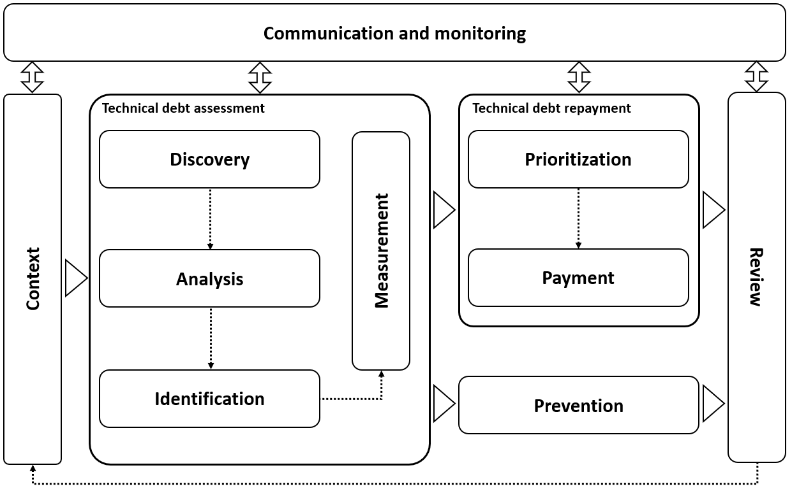

# Technical Debt Management Process

Technical Debt (TD) is a metaphor that expresses the immaturity of software artifacts and their impacts on maintenance activities and product evolution. As organizations become able to identify and understand the effects of Technical Debt, challenges arise when making investment decisions to pay it off. Although several theoretical and practical studies have been developed recently, studies that adapt the context and stakeholders objectives for Technical Debt Management (TDM) are still lacking.

This article aims to define and implement an incremental and evolutionary process of Technical Debt Management in software development, validated in a real industry application context. This study includes a new process to manage Technical Debt, which can be used to guide the company in the search for better results, periodically reviewing the practices and decisions adopted. The process provides guidelines that can be tailored for other organizations or contexts.

## Context

In the definition of the context of the TDM, the objectives, the scenario, the type of TD that will be managed, the stakeholders, and the criteria to achieve the objectives are described. This understanding is communicated to stakeholders to validate the information.

Different types of TD may require other forms of measures [27]. TD can occur in various artifacts throughout the product life cycle, having a distinct nature depending on when it is incurred and the activities with which it is associated [10]. A TDM policy should be based on both the business context of a company and the technological environment in which it operates.

>:hammer: **Tasks:** 
>-	Define the objectives: the objectives may have different aspects, such improve the internal or external quality of the product, decreasing the development cost, decreasing the onboarding time for newly hired professionals, among others. It also can be applied to different technologies.
>-	Establish and strategy: the organization must devise its strategy to manage TD. A strategy has four pillars: mission, goal, strategy, and policies.
>-	Identify the opportunities and threats: for effective TDM, it is essential to support decision-making by external and internal TD opportunities and threats related to the software product.
>-	Identify expected results: align the expected results with stakeholders' expectations. It is crucial to define key performance indicators to monitor the results during the monitoring of the TDM.
>-	Select the technologies: consider the standards inherent the technologies that will be managed.
>-	Identify the impact on existing projects and processes: identify the teams and projects affected and the need for changes in the software development process.
>-	Define tools, resources, or standards: the context should foresee the study and implementation of new tools and standards needed for TDM.
>-	Determine the extent of each cycle: determine a start and end period for performance analysis, then review the process for the next period.
>-	Identify risks: know the risks that may affect the objectives and decision-making, foreseeing strategies to mitigate and manage them.

>Outcomes: TDM criteria, Goals, Strategies, Action Plans, Responsibles, List of Artifacts (e. g. PHP source code), Risks, KPIs, and Tools.

>Responsible Role: TD Manager.
>Other participant roles: Sponsors, Managers and Team leads.
